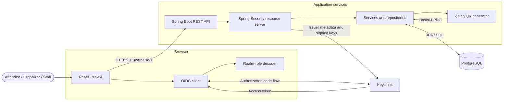
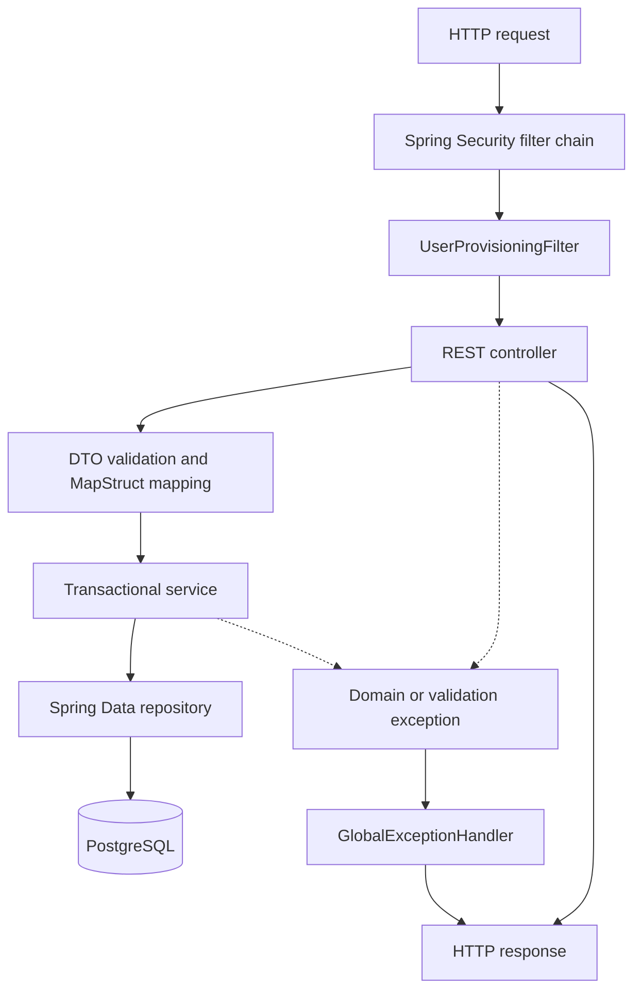
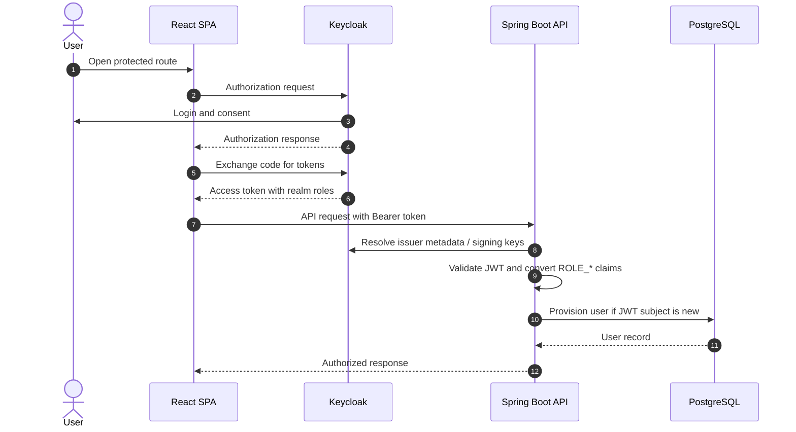
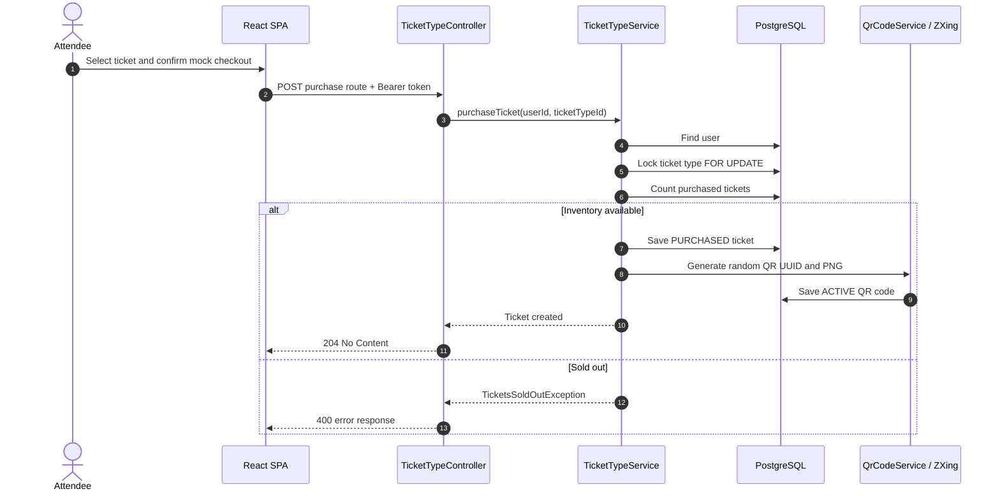
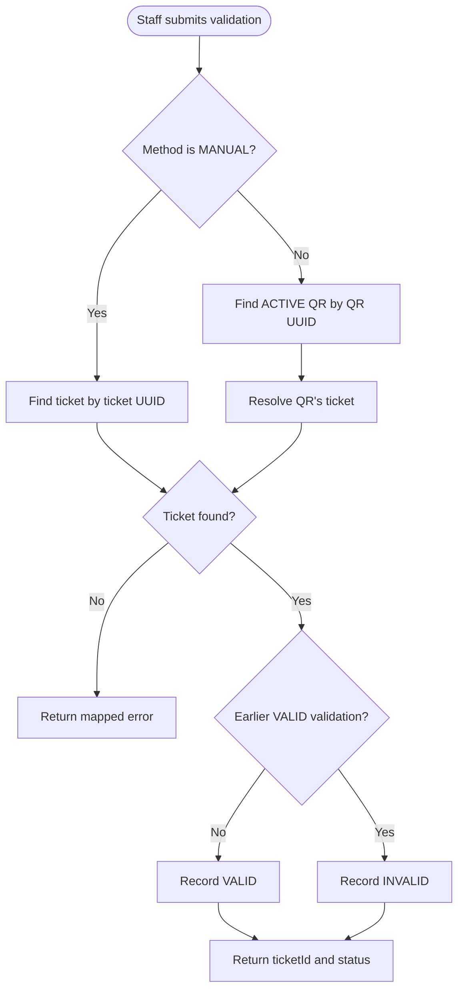

# System architecture

## Overview

The platform is a browser SPA backed by a stateless REST API. Keycloak authenticates users and issues JWTs; Spring Security validates those tokens and PostgreSQL stores application data. QR images are generated inside the API and stored in the database as base64 text.

The historical diagram is available at [drawio/architecture.png](drawio/architecture.png); the implementation details below are authoritative.

## Components

| Component | Responsibility | Important implementation |
| --- | --- | --- |
| React SPA | Public catalog, auth redirects, organizer UI, ticket wallet, scanner | React Router, native `fetch`, OIDC context, JWT role decoding |
| Spring Boot API | Authorization, ownership enforcement, validation, inventory, QR generation | Controllers -> services -> Spring Data repositories; MapStruct maps entities/DTOs |
| Keycloak | Login, realm roles, JWT issuance | Realm `event-ticket-platform`; client `event-ticket-platform-app` expected by frontend |
| PostgreSQL | Users, events, ticket types, tickets, QR codes, validation history | Hibernate creates/updates schema; PostgreSQL full-text search is used for events |
| Terraform | Original Azure infrastructure definition | Resource group, PostgreSQL Flexible Server, two Linux Web Apps, Static Web App |

## Backend layering

- Controllers define `/api/v1` resources and response status codes.
- Services own organizer/purchaser scoping, event reconciliation, inventory locking, QR generation, and validation behavior.
- Repositories encode ownership queries and the PostgreSQL search query.
- Entities own relationships and audit fields; `orm.xml` installs Spring Data's auditing listener globally.

## Authentication and authorization

The API is stateless and disables CSRF. Spring's resource server validates tokens using the configured issuer URI. `JwtAuthenticationConverter` reads `realm_access.roles`, keeps names beginning with `ROLE_`, and exposes them as Spring authorities.

The JWT `sub` must be a UUID. On the first authenticated request, the provisioning filter inserts a `users` row using `sub`, `preferred_username`, and `email`. Missing/non-UUID claims can break request processing and should be prevented in Keycloak configuration.

Public access is limited to published-event GET routes. Exact matchers require organizer for `/api/v1/events` and staff for `/api/v1/ticket-validations`; all other routes are merely authenticated. Nested organizer routes need stricter matcher coverage.

The frontend's `ProtectedRoute` only checks login. `useRoles` changes navigation/redirect behavior but is not a security boundary.

## Core flows

### Event management

1. Organizer submits an event and at least one ticket type.
2. The API uses the JWT subject to find the local organizer.
3. Event/ticket-type entities are saved in one aggregate.
4. Updates reconcile child ticket types by ID; omitted children are deleted.
5. Only `PUBLISHED` events are visible from the anonymous catalog.

### Ticket purchase

1. An authenticated user selects a ticket type from a published event page.
2. The API locks the ticket-type row with `PESSIMISTIC_WRITE`.
3. It counts existing tickets and compares the count with `totalAvailable`.
4. It saves a `PURCHASED` ticket for the local user.
5. ZXing creates a 300x300 QR containing a random UUID; the PNG is base64-encoded and stored in `qr_codes`.

The URL's `eventId`, publication state, and sales window are not currently enforced during purchase.

### Admission validation

1. Staff submits either a QR UUID (`QR_SCAN`) or ticket UUID (`MANUAL`).
2. The API finds the active QR/ticket.
3. It checks validation history for an earlier `VALID` result.
4. First use is recorded as `VALID`; later attempts are recorded as `INVALID`.

Event/staff assignment, ticket status, event dates, and QR expiration are not currently checked.

## Runtime topologies

### Local

- React: Vite development server (normally `5173`)
- API: Spring Boot (`8080` by default)
- PostgreSQL: Docker host port `5432`
- Keycloak: Docker host port `9090`
- Adminer: Docker host port `8888`

### Declared Azure topology

Terraform declares Azure Static Web Apps for the frontend, Linux App Service for the API, a containerized Keycloak App Service, and PostgreSQL Flexible Server. The checked-in frontend currently points to Render for the API and Azure for Keycloak, so the code and Terraform topology are not fully aligned.

## Cross-cutting concerns and gaps

- CORS origins are duplicated and hard-coded in both `WebConfig` and `SecurityConfig`.
- No OpenAPI generation, centralized request tracing, health/actuator endpoint, rate limit, or metrics setup is present.
- Global exception handling misses `@ExceptionHandler(Exception.class)` on its fallback method.
- Database changes rely on Hibernate `update`, not versioned migrations.
- Time fields use `LocalDateTime`; there is no persisted timezone/offset contract.
- `Double` represents ticket prices; decimal currency types are safer for real payments.
- Tests do not cover authorization, concurrent inventory, entity reconciliation, or validation replay.
