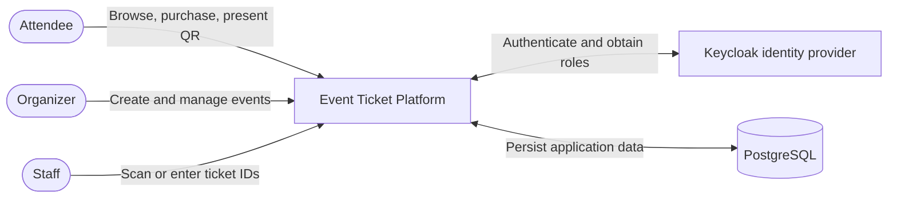
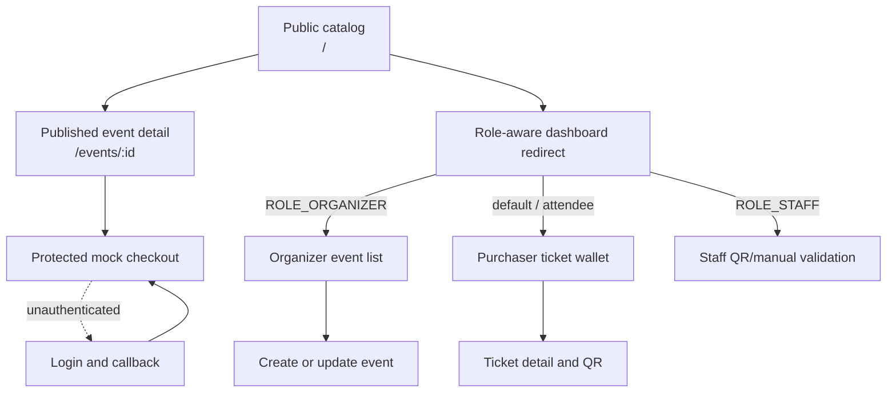
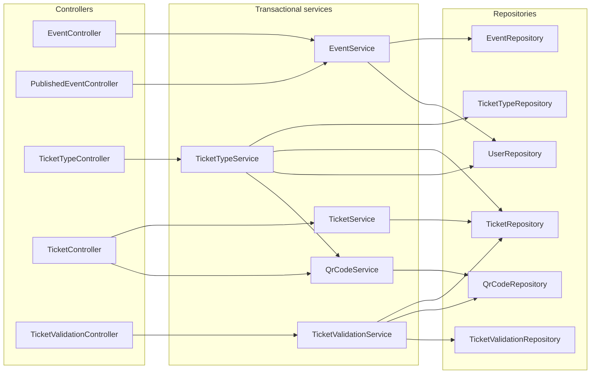
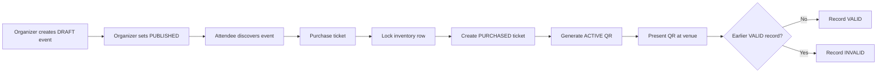

# Diagram gallery

This page provides a compact visual entry point to the platform. Detailed explanations and implementation caveats remain in the linked documents.

## System context

## Frontend route map

## Backend responsibility map

## Event-to-admission lifecycle

## More detailed diagrams

- [Architecture and authentication sequences](README.md)
- [Entity relationship and state diagrams](../data-model.md)
- [Azure/Terraform deployment topology](../deployment.md)

All diagrams use Mermaid so they remain reviewable in source control and render on GitHub and other Mermaid-enabled Markdown viewers.
