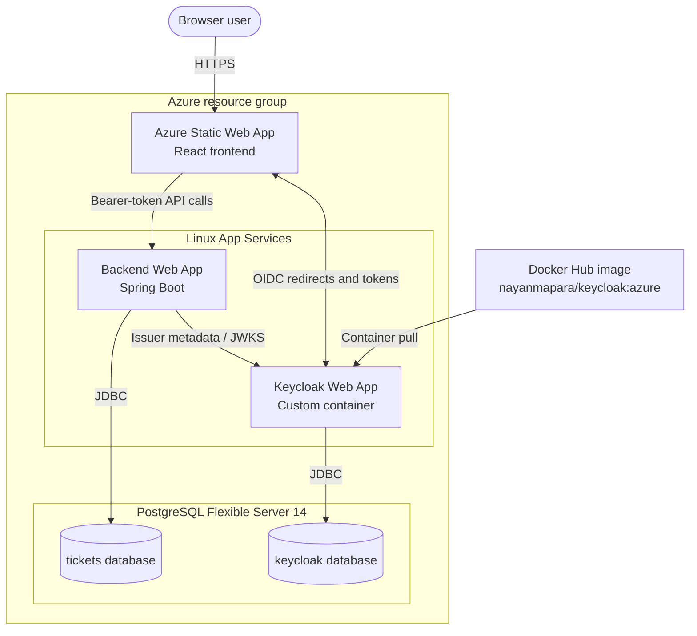

# Deployment and infrastructure

This repository contains two partially divergent deployment stories:

- Terraform declares an Azure topology.
- Current frontend source calls a Render API and an Azure-hosted Keycloak instance directly.

Verify the intended target and align code/configuration before deploying.

## Backend artifact and container

The Maven project builds `backend/tickets/target/tickets-0.0.1-SNAPSHOT.jar`. Its Dockerfile copies that pre-built JAR into a Java 21 Alpine image:

```bash
cd backend/tickets
./mvnw clean package
docker build -t event-ticket-backend .
```

Production Spring variables:

| Variable | Purpose |
| --- | --- |
| `SPRING_PROFILES_ACTIVE=prod` | Select production properties |
| `SPRING_DATASOURCE_URL` | PostgreSQL JDBC URL |
| `SPRING_DATASOURCE_USERNAME` | Database login |
| `SPRING_DATASOURCE_PASSWORD` | Database password |
| `JWT_ISSUER_URI` | Exact Keycloak realm issuer URL |

Do not place production secrets in Git or Terraform variable defaults.

## Keycloak image

`keycloak/Dockerfile` builds Keycloak 26 with PostgreSQL support and optimized startup. Its checked-in hostname is Render-specific. Runtime configuration must include database credentials, admin bootstrap credentials, proxy headers, and hostnames appropriate to the chosen environment.

The Azure Terraform module references `nayanmapara/keycloak:azure`, not a locally built image. Build/publish provenance and tag immutability should be documented in the release process.

## Terraform topology



The diagram shows the topology declared by Terraform. Current frontend source calls a Render-hosted API directly, so it does not fully follow this path until configuration is aligned.

Terraform >= 1.3 with AzureRM `~> 3.90` declares:

- One resource group
- PostgreSQL Flexible Server 14
- `tickets` and `keycloak` databases
- Keycloak Linux Web App using a custom container
- Backend Linux Web App
- Frontend Azure Static Web App

Basic workflow:

```bash
cd terraform
terraform init
terraform fmt -check -recursive
terraform validate
terraform plan -var-file=terraform.tfvars
terraform apply -var-file=terraform.tfvars
```

Use a protected remote state backend and CI identity for shared environments. The repository currently defines no backend block.

## Root Terraform inputs

| Input | Notes |
| --- | --- |
| `subscription_id` | Azure subscription UUID |
| `location` | Defaults to `Canada Central` |
| `resource_group_name` | Defaults to `event-ticket-platform-rg` |
| `postgres_username` / `postgres_password` | Flexible Server administrator credentials |
| `keycloak_admin_password` | Keycloak bootstrap administrator secret |
| `db_name`, `db_username`, `db_password`, `db_fqdn` | Passed directly to Keycloak; currently duplicate values that database module outputs could supply |
| `kc_hostname_admin_url`, `kc_hostname_url` | Public/admin Keycloak URLs |
| `static_site_name` | Globally unique Static Web App name |
| `backend_url` | Written as frontend app setting, but current frontend code does not read it |

Create an untracked `terraform.tfvars` with environment-specific values. Do not commit it.

## Outputs

`terraform output` exposes Keycloak URL/issuer, backend URL, resource-group name, and Static Web App URL. Sensitive credentials are not outputs.

## Known infrastructure problems

Address these before relying on the configuration for production:

1. Backend Maven/Docker use Java 21, while the Azure App Service module requests Java 17.
2. The PostgreSQL firewall permits `0.0.0.0` through `255.255.255.255`.
3. The frontend module ignores its `location` input and hard-codes `Central US`.
4. The frontend receives `VITE_BACKEND_URL` at resource runtime, but Vite variables are normally embedded at build time and current source uses a constant anyway.
5. Keycloak uses the free App Service plan, `always_on=false`, and disabled App Service storage; cold starts and persistence depend on external PostgreSQL and image behavior.
6. Database username output returns the server resource name rather than the configured administrator login, which may be incorrect for clients.
7. Keycloak database inputs are duplicated rather than wired directly from the database module.
8. CORS and frontend service URLs are hard-coded in application source.
9. Production still uses Hibernate schema update and has no migration/rollback process.
10. The checked-in workflow files, if present with `.txt` extensions, are templates rather than executable GitHub Actions workflows; GitHub requires `.yml` or `.yaml` under `.github/workflows`.

## Release checklist

- Run backend tests/package and frontend lint/build.
- Verify Terraform format, validation, and plan.
- Confirm Java runtime matches the built artifact.
- Confirm frontend API/OIDC URLs and Keycloak redirect origins.
- Confirm backend CORS origins and JWT issuer.
- Apply reviewed database migrations and verify backup recovery.
- Use versioned immutable container tags.
- Smoke-test login, public search, organizer CRUD, purchase, QR retrieval, and first/replay validation.
- Record deployed Terraform outputs and artifact versions.

## Destructive operations

`terraform destroy`, database replacement, and removal of the Keycloak volume/server can permanently remove application or identity data. Take verified backups, review the exact plan, and confirm the selected Azure subscription/workspace before destructive changes.
